# Software Requirements Specification (SRS) & Enterprise System Architecture
## Project: Interview Preparation Assistant using Multi-Agent AI System

---

## Executive Summary & Document Metadata

| Metadata Field | Project Specification Details |
| :--- | :--- |
| **Project Title** | Interview Preparation Assistant using Multi-Agent AI System |
| **Document Version** | 1.0.0 (Enterprise Specification & Academic Standard) |
| **Frontend Tech Stack** | React.js (v18+), Tailwind CSS, Axios, React Router v6, React Hook Form, Chart.js |
| **Backend Tech Stack** | FastAPI (Python 3.11), Uvicorn, SQLAlchemy ORM, Pydantic v2, PyJWT |
| **AI & Multi-Agent Framework**| LangGraph, Groq API (Llama 3 / Mixtral models), LangChain Prompt Templates |
| **Database & Storage** | MySQL 8.0+, File System (`uploads/resumes/`, `uploads/reports/`) |
| **Target Deployment** | Vercel (Frontend), Render / Oracle Cloud Infrastructure (Backend), Managed MySQL |

---

# Table of Contents
1. [Chapter 1 – Introduction](#chapter-1--introduction)
2. [Chapter 2 – Overall Description & User Roles](#chapter-2--overall-description--user-roles)
3. [Chapter 3 – System Features & Functional Modules](#chapter-3--system-features--functional-modules)
4. [Chapter 4 – Multi-Agent AI System Architecture](#chapter-4--multi-agent-ai-system-architecture)
5. [Chapter 5 – LangGraph Workflow & State Management](#chapter-5--langgraph-workflow--state-management)
6. [Chapter 6 – Database Design & Schema Specifications](#chapter-6--database-design--schema-specifications)
7. [Chapter 7 – REST API Specification Matrix](#chapter-7--rest-api-specification-matrix)
8. [Chapter 8 – Frontend Architecture & User Interface Design](#chapter-8--frontend-architecture--user-interface-design)
9. [Chapter 9 – Enterprise Diagram Suite (16 Diagrams)](#chapter-9--enterprise-diagram-suite-16-diagrams)
10. [Chapter 10 – Project Directory & Codebase Structure](#chapter-10--project-directory--codebase-structure)
11. [Chapter 11 – Development Roadmap & Future Enhancements](#chapter-11--development-roadmap--future-enhancements)

---

# Chapter 1 – Introduction

## 1.1 Purpose
This Software Requirements Specification (SRS) document defines the complete technical, functional, and architectural requirements for the **Interview Preparation Assistant using Multi-Agent AI System**. The system provides job seekers, students, and professionals with an intelligent, multi-agent AI environment that parses resumes, analyzes job descriptions, calculates ATS alignment scores, conducts domain-adaptive mock interviews (Technical, Coding, HR), evaluates responses across multiple qualitative dimensions, and generates actionable analytical reports.

## 1.2 Scope
The scope of this project encompasses:
- **Resume & Job Description Analysis**: Extracting structured metadata (skills, experience, education, projects, keywords) using specialized LLM agents and OCR/parsing engines.
- **ATS & Skill Matching Engine**: Computing quantitative ATS scores, identifying critical skill gaps, and providing tailored recommendation roadmaps.
- **Multi-Agent Interview Engine**: Generating dynamic, role-aligned questions across Technical, Data Structures & Algorithms (DSA), System Design, and Behavioral HR domains.
- **Multi-Metric Evaluation Engine**: Assessing candidate answers for technical accuracy, grammar, communication clarity, confidence level, and completeness.
- **Performance Analytics & Report Generation**: Delivering real-time dashboard widgets and downloadable, enterprise-grade PDF reports.
- **Role-Based Access Control**: Separate workflows and administration capabilities for **Candidates** and **System Administrators**.

## 1.3 Objectives
- **Target ATS Accuracy**: Achieve >90% precision in extracting technical skills and experience levels from standard PDF/DOCX resumes.
- **Adaptive Question Scaling**: Dynamically adapt question difficulty (Easy, Medium, Hard) based on job description seniority and real-time candidate answers.
- **Low-Latency Orchestration**: Maintain an average response time of under 3.5 seconds per multi-agent processing step using Groq API high-speed inference.
- **Comprehensive Candidate Insights**: Provide multi-metric radar charts (Technical, Grammar, Confidence, Communication) to highlight actionable growth areas.

## 1.4 Definitions, Acronyms, and Abbreviations
- **ATS**: Applicant Tracking System
- **DAG**: Directed Acyclic Graph
- **DSA**: Data Structures and Algorithms
- **JWT**: JSON Web Token
- **LLM**: Large Language Model
- **ORM**: Object-Relational Mapping (SQLAlchemy)
- **REST**: Representational State Transfer
- **SRS**: Software Requirements Specification

## 1.5 Intended Audience
This document is prepared for:
1. **Software Developers & AI Engineers**: To guide backend, frontend, and multi-agent implementation.
2. **System Architects & DevOps**: For environment provisioning, deployment pipelines, and database optimization.
3. **Project Evaluators & Stakeholders**: For auditing compliance with enterprise standards and academic project criteria.

## 1.6 Assumptions & Dependencies
- **Groq Cloud API**: Uninterrupted availability of Groq's high-speed inference endpoints for Llama 3 models.
- **Client Connectivity**: Candidate access to modern web browsers (Chrome, Edge, Firefox, Safari) with active internet connection.
- **Document Formats**: Resumes supplied in valid PDF or DOCX format under 10MB file size.

## 1.7 Constraints
- **Data Security**: Hashing of candidate credentials using bcrypt; token expiration enforced via JWT.
- **Stateless Agent State**: State transfers in LangGraph must be fully deterministic and serializable in JSON format.
- **Database Concurrency**: MySQL transaction isolation must support concurrent candidate mock sessions without deadlocks.

---

# Chapter 2 – Overall Description & User Roles

## 2.1 Product Perspective
The **Interview Preparation Assistant** operates as a modern cloud-native web application. The React frontend interacts with the FastAPI application layer via secure RESTful APIs. FastAPI orchestrates agent state graph executions powered by LangGraph and Groq LLM API, while persisting domain entities in a MySQL database.

```
+-------------------------------------------------------------------+
|                        PRESENTATION LAYER                         |
|             React.js + Tailwind CSS (Vercel Hosted)               |
+-------------------------------------------------------------------+
                                  | REST / JSON (JWT Auth)
                                  v
+-------------------------------------------------------------------+
|                         APPLICATION API                           |
|               FastAPI + Uvicorn (Render / OCI Hosted)             |
+-------------------------------------------------------------------+
        |                                           |
        v ORM                                       v State Graph
+-----------------------+               +---------------------------+
|    STORAGE LAYER      |               |  AGENT ORCHESTRATION LAYER|
|    MySQL 8.0 DB       |               | LangGraph + Groq LLM API  |
+-----------------------+               +---------------------------+
```

## 2.2 User Classes and Characteristics

### 1. Candidate (Primary User)
- **Profile**: Job seekers, university graduates, professionals preparing for technical or managerial interviews.
- **Key Capabilities**:
  - Register, authenticate, manage profile.
  - Upload resume and target job descriptions.
  - Conduct interactive mock interviews (Technical, Coding, HR).
  - Submit answers via text (and future voice integration).
  - View interactive analytical dashboards and download PDF performance reports.

### 2. Administrator (System Manager)
- **Profile**: Platform administrators, content moderators, academic instructors.
- **Key Capabilities**:
  - Monitor registered user activity and global interview metrics.
  - View aggregate system performance logs and agent execution rates.
  - Manage question banks, prompt templates, and difficulty parameters.
  - Audit candidate reports and system analytics.

## 2.3 Operating Environment
- **Client Side**: Cross-platform Web Browsers (Chrome 100+, Firefox 100+, Safari 15+, Edge 100+).
- **Server Side**: Python 3.11 runtime on Linux (Ubuntu 22.04 LTS), Uvicorn ASGI server with 4 worker processes.
- **Database**: MySQL 8.0 Community Server / Managed InnoDB instance.
- **External API Services**: Groq Inference Cloud (`llama-3.3-70b-versatile` / `llama3-8b-8192`).

---

# Chapter 3 – System Features & Functional Modules

The system comprises **12 Core Functional Modules**:

### 3.1 User Management & Authentication Module
- **Registration**: Email validation, password strength enforcement, role assignment (`Candidate` or `Admin`).
- **Authentication**: JWT token generation upon successful login; refresh token rotation.
- **Password Management**: Secure password reset flow using cryptographic reset tokens.

### 3.2 Resume Parsing Module
- **File Ingestion**: Accepts `.pdf` and `.docx` files up to 10MB.
- **Text Extraction**: Uses `PyPDF2` / `pdfplumber` / `docx2txt` with OCR fallback for image-based PDFs.
- **Entity Extraction**: Parses structured fields (Skills, Experience, Education, Projects).

### 3.3 Job Description (JD) Module
- **Ingestion**: Supports direct text entry or document upload.
- **Parsing**: Extracts required technical skills, mandatory experience years, core responsibilities, and company target keywords.

### 3.4 ATS Analysis Module
- **Scoring Engine**: Calculates overall ATS compatibility percentage (0-100%).
- **Keyword Match**: Measures exact and semantic keyword overlap between Resume and JD.
- **Formatting Audit**: Checks section header conventions and readability.

### 3.5 Skill Matching Module
- **Gap Analysis**: Identifies critical missing technical and soft skills.
- **Matching Percentage**: Computes weighted match score (Core Skills 60%, Experience 25%, Education 15%).
- **Recommendations**: Generates tailored learning topics to bridge identified gaps.

### 3.6 Question Generation Module
- **Contextual Prompting**: Synthesizes Resume + JD context to craft candidate-specific questions.
- **Adaptive Difficulty**: Categorizes questions into Easy, Medium, and Hard tiers.
- **Category Coverage**: Generates technical conceptual, project-deep-dive, and situational scenario questions.

### 3.7 Coding Interview Module
- **Domain Focus**: DSA (Array, Tree, Graph, Dynamic Programming), SQL, Python, React, FastAPI.
- **Problem Delivery**: Delivers problem statement, input/output constraints, sample test cases, and starter code snippets.

### 3.8 HR Interview Module
- **Behavioral Questions**: Uses STAR method (Situation, Task, Action, Result) templates.
- **Leadership & Situational**: Evaluates teamwork, conflict resolution, project management, and career goals.

### 3.9 Real-Time Feedback Module
- **Multi-Metric Scoring**: Evaluates candidate submissions across 5 distinct axes:
  1. *Technical Accuracy* (0-100)
  2. *Grammar & Syntax* (0-100)
  3. *Communication Clarity* (0-100)
  4. *Confidence Indicator* (0-100)
  5. *Completeness Score* (0-100)
- **Detailed Corrections**: Offers model answer benchmarks and corrective suggestions.

### 3.10 Comprehensive Report Module
- **Score Aggregation**: Computes overall interview readiness index.
- **PDF Generation**: Generates styled PDF reports with structured score tables and recommendations using ReportLab / HTML-to-PDF engines.
- **Storage**: Persists reports in `uploads/reports/` and stores reference paths in MySQL.

### 3.11 Dashboard Module
- **Real-Time Visualizations**: Powered by Chart.js in React.
- **Widgets Included**: ATS Score, Skill Match %, Technical Score, Coding Score, HR Score, Communication, Grammar, Confidence, Overall Readiness, Recent Sessions List, Weak Skills List, Recommended Topics.

### 3.12 Admin Module
- **User Management**: View user listing, toggle active/disabled states, inspect session counts.
- **Analytics & Logs**: Monitor agent request volumes, API latencies, error frequencies.
- **Prompt Management**: Live editor to update system prompts for the 8 AI agents.

---

# Chapter 4 – Multi-Agent AI System Architecture

The core intelligent layer consists of **8 Specialized AI Agents** operating as discrete nodes within a LangGraph orchestration network.

```
                     +---------------------------+
                     |    1. Resume Analyzer     |
                     +---------------------------+
                                   |
                                   v
                     +---------------------------+
                     |    2. JD Analyzer         |
                     +---------------------------+
                                   |
                                   v
                     +---------------------------+
                     |    3. Skill Match Agent   |
                     +---------------------------+
                                   |
                                   v
                     +---------------------------+
                     |    4. Question Generator  |
                     +---------------------------+
                                   |
                     +-------------+-------------+
                     |                           |
                     v                           v
      +---------------------------+ +---------------------------+
      |  5. Coding Interview Agent| |   6. HR Interview Agent   |
      +---------------------------+ +---------------------------+
                     |                           |
                     +-------------+-------------+
                                   |
                                   v
                     +---------------------------+
                     |    7. Feedback Agent      |
                     +---------------------------+
                                   |
                                   v
                     +---------------------------+
                     |    8. Report Generator    |
                     +---------------------------+
```

### Agent Detailed Specifications

| Agent Name | Input Payload | LLM Engine & Prompt Strategy | Output Payload |
| :--- | :--- | :--- | :--- |
| **1. Resume Analyzer** | Raw Resume Text / PDF File | Zero-shot structured JSON extraction via Groq | Extracted Skills, Experience, Education, Projects, ATS Base Score |
| **2. JD Analyzer** | Raw JD Text | Key-phrase extraction & Seniority classifier | Required Skills, Min Experience, Responsibilities, Company Keywords |
| **3. Skill Match Agent** | Extracted Resume JSON + JD JSON | Semantic vector similarity & set intersection | Skill Match %, Missing Skills List, Actionable Recommendations |
| **4. Question Generator** | Skill Match Output + Role Context | Few-shot role-based question synthesis | Technical Questions, Project Questions, Scenario Questions (Easy/Med/Hard) |
| **5. Coding Agent** | Target Role Domain & Seniority | Code problem generation with test cases | DSA / SQL / Python / React / FastAPI problem sets + Starter Code |
| **6. HR Agent** | Role Context + Company Profile | Behavioral STAR question framing | HR, Leadership, Teamwork, Conflict Resolution questions |
| **7. Feedback Agent** | Candidate Answer + Question + Context | Multi-criteria rubric evaluator LLM chain | Scores (Grammar, Technical, Comm, Confidence, Completeness) + Explanations |
| **8. Report Generator** | All Session Scores & Answers | Data aggregation & Markdown/HTML PDF template renderer | Final Performance PDF, Radar Chart Data, Preparation Roadmap |

---

# Chapter 5 – LangGraph Workflow & State Management

## 5.1 State Machine Schema (`InterviewState`)
In LangGraph, state is maintained in a centralized `TypedDict` passed across all agents.

```python
from typing import List, Dict, Any, Optional
from typing_extensions import TypedDict

class InterviewState(TypedDict):
    user_id: int
    session_id: int
    resume_raw_text: str
    jd_raw_text: str
    
    # Resume Analyzer Output
    resume_skills: List[str]
    resume_experience: List[Dict[str, Any]]
    resume_education: List[Dict[str, Any]]
    resume_projects: List[Dict[str, Any]]
    ats_score: float
    
    # JD Analyzer Output
    jd_skills: List[str]
    jd_experience_years: int
    jd_keywords: List[str]
    
    # Skill Match Output
    skill_match_percentage: float
    missing_skills: List[str]
    skill_recommendations: List[str]
    
    # Question Generator Outputs
    technical_questions: List[Dict[str, Any]]
    coding_questions: List[Dict[str, Any]]
    hr_questions: List[Dict[str, Any]]
    
    # User Submissions & Feedback
    current_question_index: int
    user_answers: Dict[int, str]
    question_feedbacks: Dict[int, Dict[str, Any]]
    
    # Final Report Output
    overall_readiness_score: float
    report_pdf_path: str
    is_completed: bool
```

## 5.2 Conditional Routing Logic
The LangGraph router uses a dynamic router function to direct control flow based on question types and interview state completion.

```
       START ──► [Resume Analyzer] ──► [JD Analyzer] ──► [Skill Matcher]
                                                               │
                                                               ▼
                                                      [Question Generator]
                                                               │
                                         ┌─────────────────────┴─────────────────────┐
                                         ▼                                           ▼
                              [Coding Interview Agent]                     [HR Interview Agent]
                                         │                                           │
                                         └─────────────────────┬─────────────────────┘
                                                               ▼
                                                       [User Submissions]
                                                               │
                                                               ▼
                                                        [Feedback Agent]
                                                               │
                                                               ▼
                                                       [Report Generator]
                                                               │
                                                               ▼
                                                          (Store MySQL) ──► END
```

---

# Chapter 6 – Database Design & Schema Specifications

The relational schema is implemented in **MySQL 8.0** using **SQLAlchemy ORM**.

## 6.1 Entity Relationship Summary

```
+------------+       1:N       +------------+
|   Users    |---------------->|  Resumes   |
+------------+                 +------------+
   |      |
   |1:N   |1:N
   v      v
+------------+               +------------+
|JobDescr-   |               |  Reports   |
|iptions     |               +------------+
+------------+
   |
   |1:N
   v
+-------------------+     1:N     +------------+
|InterviewSessions  |------------>| Questions  |
+-------------------+             +------------+
                                        |
                                        |1:1
                                        v
                                  +------------+     1:1     +------------+
                                  |  Answers   |------------>|  Feedback  |
                                  +------------+             +------------+
```

## 6.2 Data Tables DDL & Schema Details

### 1. `users` Table
```sql
CREATE TABLE users (
    id INT AUTO_INCREMENT PRIMARY KEY,
    name VARCHAR(100) NOT NULL,
    email VARCHAR(150) NOT NULL UNIQUE,
    password VARCHAR(255) NOT NULL,
    role ENUM('candidate', 'admin') DEFAULT 'candidate',
    created_at TIMESTAMP DEFAULT CURRENT_TIMESTAMP,
    INDEX idx_user_email (email)
) ENGINE=InnoDB DEFAULT CHARSET=utf8mb4;
```

### 2. `resumes` Table
```sql
CREATE TABLE resumes (
    id INT AUTO_INCREMENT PRIMARY KEY,
    user_id INT NOT NULL,
    resume_path VARCHAR(255) NOT NULL,
    skills JSON,
    education JSON,
    experience JSON,
    projects JSON,
    ats_score FLOAT DEFAULT 0.0,
    created_at TIMESTAMP DEFAULT CURRENT_TIMESTAMP,
    FOREIGN KEY (user_id) REFERENCES users(id) ON DELETE CASCADE
) ENGINE=InnoDB DEFAULT CHARSET=utf8mb4;
```

### 3. `job_descriptions` Table
```sql
CREATE TABLE job_descriptions (
    id INT AUTO_INCREMENT PRIMARY KEY,
    user_id INT NOT NULL,
    description TEXT NOT NULL,
    skills JSON,
    experience_years INT DEFAULT 0,
    created_at TIMESTAMP DEFAULT CURRENT_TIMESTAMP,
    FOREIGN KEY (user_id) REFERENCES users(id) ON DELETE CASCADE
) ENGINE=InnoDB DEFAULT CHARSET=utf8mb4;
```

### 4. `interview_sessions` Table
```sql
CREATE TABLE interview_sessions (
    id INT AUTO_INCREMENT PRIMARY KEY,
    user_id INT NOT NULL,
    jd_id INT,
    date TIMESTAMP DEFAULT CURRENT_TIMESTAMP,
    duration_minutes INT DEFAULT 0,
    status ENUM('pending', 'in_progress', 'completed') DEFAULT 'pending',
    FOREIGN KEY (user_id) REFERENCES users(id) ON DELETE CASCADE,
    FOREIGN KEY (jd_id) REFERENCES job_descriptions(id) ON DELETE SET NULL
) ENGINE=InnoDB DEFAULT CHARSET=utf8mb4;
```

### 5. `questions` Table
```sql
CREATE TABLE questions (
    id INT AUTO_INCREMENT PRIMARY KEY,
    session_id INT NOT NULL,
    question_text TEXT NOT NULL,
    difficulty ENUM('easy', 'medium', 'hard') DEFAULT 'medium',
    type ENUM('technical', 'coding', 'hr', 'scenario') NOT NULL,
    FOREIGN KEY (session_id) REFERENCES interview_sessions(id) ON DELETE CASCADE
) ENGINE=InnoDB DEFAULT CHARSET=utf8mb4;
```

### 6. `answers` Table
```sql
CREATE TABLE answers (
    id INT AUTO_INCREMENT PRIMARY KEY,
    question_id INT NOT NULL UNIQUE,
    answer_text TEXT NOT NULL,
    submitted_at TIMESTAMP DEFAULT CURRENT_TIMESTAMP,
    FOREIGN KEY (question_id) REFERENCES questions(id) ON DELETE CASCADE
) ENGINE=InnoDB DEFAULT CHARSET=utf8mb4;
```

### 7. `feedback` Table
```sql
CREATE TABLE feedback (
    id INT AUTO_INCREMENT PRIMARY KEY,
    answer_id INT NOT NULL UNIQUE,
    grammar_score FLOAT NOT NULL,
    technical_score FLOAT NOT NULL,
    communication_score FLOAT NOT NULL,
    confidence_score FLOAT NOT NULL,
    completeness_score FLOAT NOT NULL,
    overall_score FLOAT NOT NULL,
    comments TEXT,
    FOREIGN KEY (answer_id) REFERENCES answers(id) ON DELETE CASCADE
) ENGINE=InnoDB DEFAULT CHARSET=utf8mb4;
```

### 8. `reports` Table
```sql
CREATE TABLE reports (
    id INT AUTO_INCREMENT PRIMARY KEY,
    user_id INT NOT NULL,
    session_id INT NOT NULL UNIQUE,
    overall_score FLOAT NOT NULL,
    pdf_path VARCHAR(255) NOT NULL,
    skill_gap_summary JSON,
    improvement_plan JSON,
    created_at TIMESTAMP DEFAULT CURRENT_TIMESTAMP,
    FOREIGN KEY (user_id) REFERENCES users(id) ON DELETE CASCADE,
    FOREIGN KEY (session_id) REFERENCES interview_sessions(id) ON DELETE CASCADE
) ENGINE=InnoDB DEFAULT CHARSET=utf8mb4;
```

---

# Chapter 7 – REST API Specification Matrix

All backend endpoints are built using **FastAPI** with Pydantic payload validation and JWT authorization headers (`Authorization: Bearer <token>`).

| Module | HTTP Method | Endpoint Route | Request Body / Params | Response Description |
| :--- | :--- | :--- | :--- | :--- |
| **Auth** | `POST` | `/api/v1/auth/register` | `{ name, email, password, role }` | User creation confirmation + ID |
| **Auth** | `POST` | `/api/v1/auth/login` | `{ email, password }` | Access Token (JWT) + User Profile |
| **Auth** | `POST` | `/api/v1/auth/logout` | Header Token | Token blacklist confirmation |
| **Resume** | `POST` | `/api/v1/resume/upload` | Multipart `file` (.pdf/.docx) | Parsed skills, experience & ATS score |
| **Resume** | `GET` | `/api/v1/resume` | Header Token | Candidate active parsed resume |
| **Resume** | `DELETE`| `/api/v1/resume/{id}` | Path `id` | Deletion status |
| **JD** | `POST` | `/api/v1/jd/upload` | `{ description_text }` or File | Parsed JD requirements & skills |
| **JD** | `GET` | `/api/v1/jd` | Header Token | List of saved job descriptions |
| **Interview**| `POST` | `/api/v1/interview/start` | `{ resume_id, jd_id }` | Initiates LangGraph session & returns initial question batch |
| **Interview**| `POST` | `/api/v1/interview/answer`| `{ question_id, answer_text }` | Submits candidate response & triggers Feedback Agent |
| **Interview**| `GET` | `/api/v1/feedback/{answer_id}`| Path `answer_id` | Multi-metric scores & AI analysis |
| **Reports** | `GET` | `/api/v1/report/{session_id}`| Path `session_id` | Full analytical report JSON |
| **Reports** | `GET` | `/api/v1/report/{id}/pdf` | Path `id` | PDF file stream download |
| **Dashboard**| `GET` | `/api/v1/dashboard` | Header Token | Aggregated scores, session history, radar metrics |
| **Admin** | `GET` | `/api/v1/admin/users` | Admin JWT Header | All users list with activity status |
| **Admin** | `GET` | `/api/v1/admin/analytics` | Admin JWT Header | System-wide LLM token usage & session metrics |

---

# Chapter 8 – Frontend Architecture & User Interface Design

## 8.1 Page Routing Layout (12 Frontend Pages)
The React application utilizes `react-router-dom` v6 with protected route wrappers for Candidates and Admins.

```
/ (Landing Page)
├── /register (Candidate & Admin Registration)
├── /login (Authentication)
├── /dashboard (Candidate Main Analytics Hub)
├── /resume-upload (Resume Processing Interface)
├── /jd-upload (Job Description Parsing Interface)
├── /interview (Interactive Mock Interview Session)
├── /coding-practice (IDE-Style Coding Environment)
├── /feedback (Instant Real-time Answer Feedback)
├── /reports (Historical Session Reports & PDF Download)
├── /profile (User Settings & Resume Management)
├── /settings (Theme, Preferences & Security)
└── /admin (Admin Control Dashboard & System Logs)
```

## 8.2 Dashboard Widgets Specification (12 Core Widgets)
1. **Resume ATS Score Widget**: Gauge meter showing 0-100% ATS score.
2. **Skill Match % Widget**: Circular progress indicator comparing candidate vs. JD skills.
3. **Technical Score Widget**: Progress bar evaluating technical question accuracy.
4. **Coding Score Widget**: Score metric evaluating algorithm problem performance.
5. **HR Score Widget**: Score metric for behavioral & soft skills.
6. **Communication Score Widget**: Text clarity indicator.
7. **Grammar Score Widget**: Grammar correctness rating.
8. **Confidence Score Widget**: Sentiment and tone rating.
9. **Overall Readiness Index**: Aggregated composite score for target role readiness.
10. **Recent Sessions List**: Table displaying past mock interview dates, roles, and scores.
11. **Weak Skills Badge List**: Tag cloud highlighting missing technical domains.
12. **Recommended Topics List**: Interactive roadmap suggestions.

---

# Chapter 9 – Enterprise Diagram Suite (16 Diagrams)

### 9.1 System Architecture Diagram
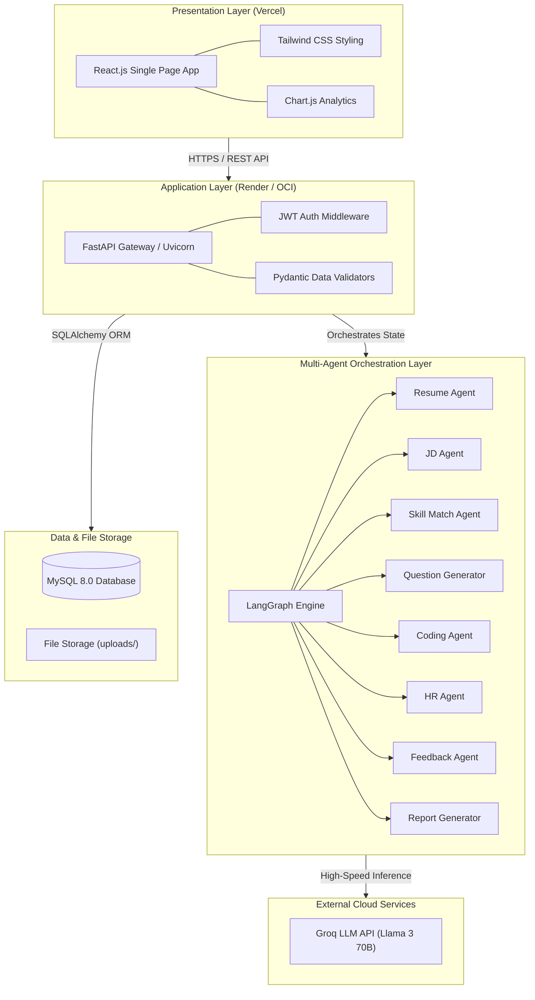

### 9.2 Multi-Agent Architecture Diagram
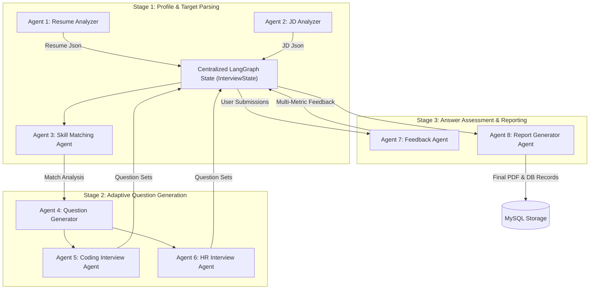

### 9.3 LangGraph Workflow Diagram
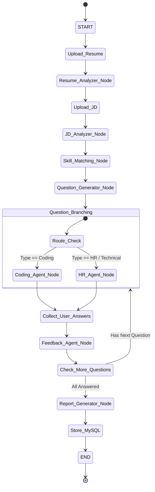

### 9.4 Use Case Diagram
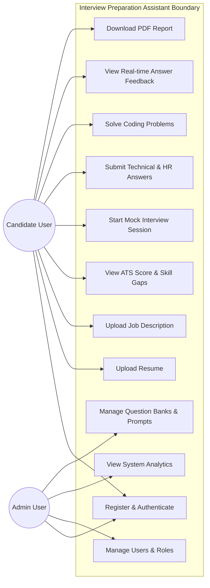

### 9.5 Class Diagram
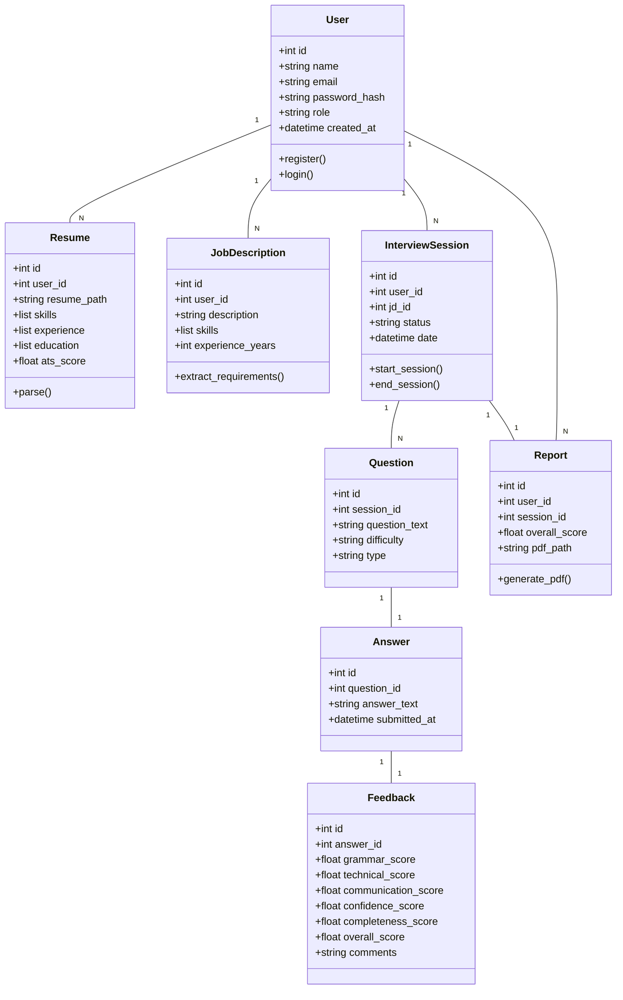

### 9.6 Entity Relationship (ER) Diagram
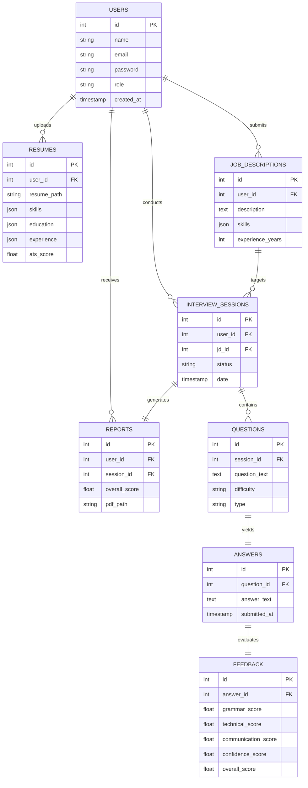

### 9.7 Sequence Diagram
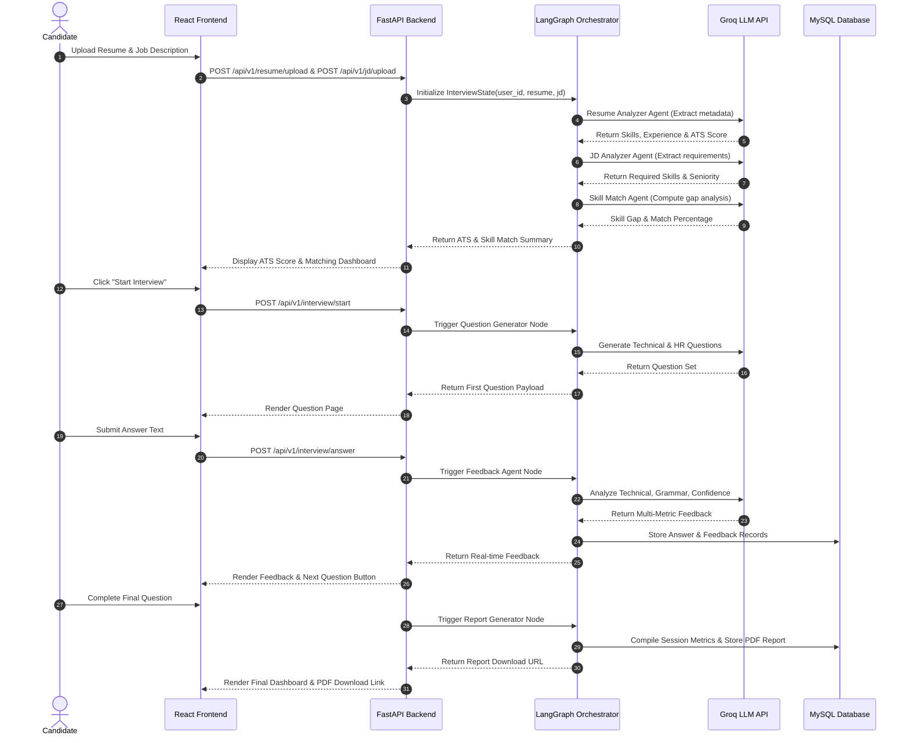

### 9.8 Activity Diagram
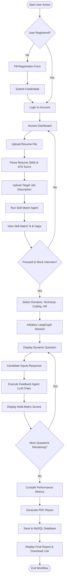

### 9.9 Component Diagram
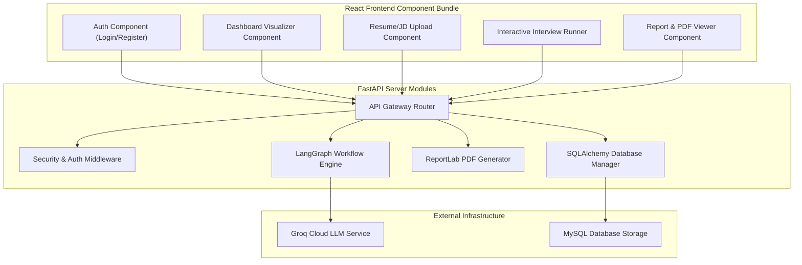

### 9.10 Deployment Diagram
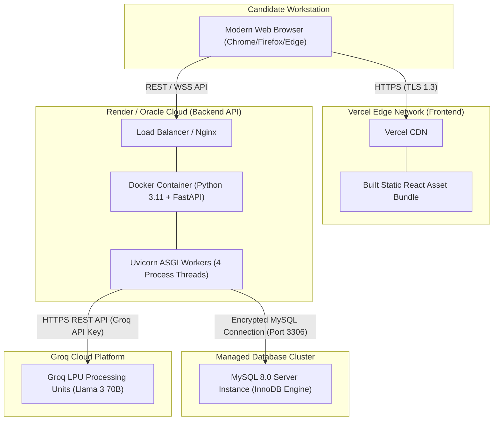

### 9.11 Data Flow Diagram (Level 0 - Context Diagram)
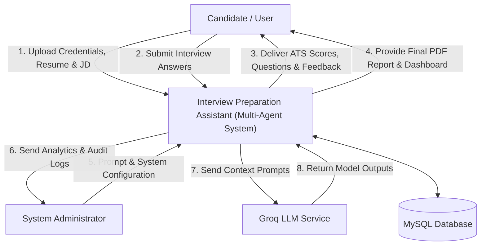

### 9.12 Data Flow Diagram (Level 1)
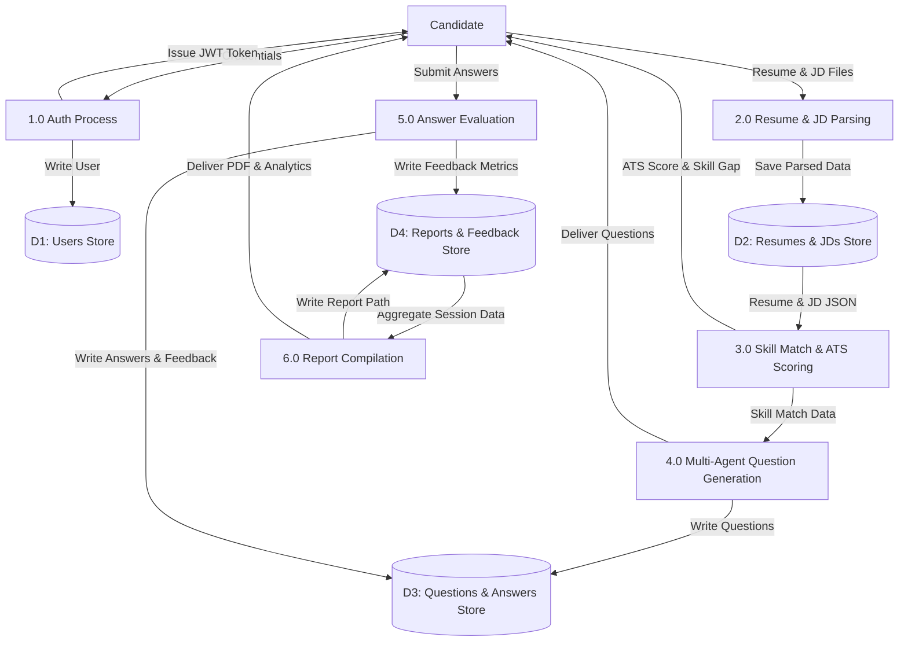

### 9.13 API Flow Diagram
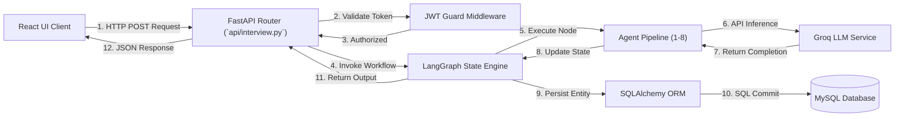

### 9.14 Database Schema Diagram
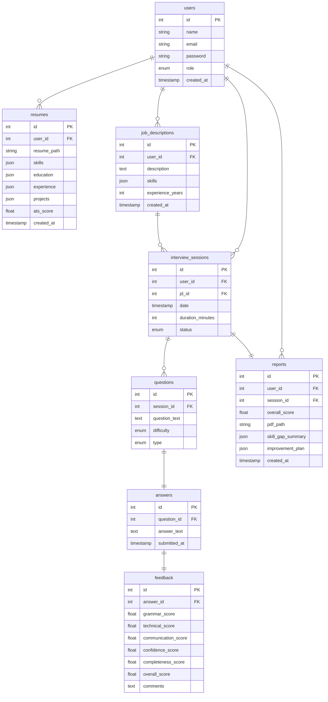

### 9.15 Agent Communication Diagram
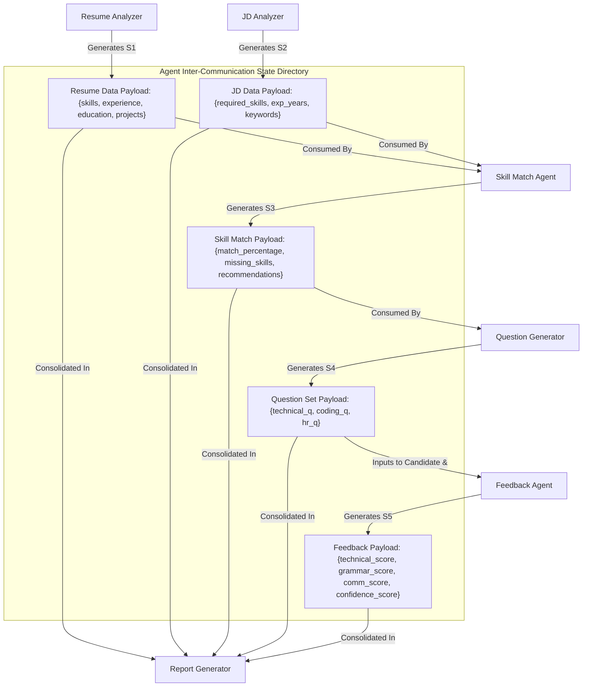

### 9.16 Folder Structure Diagram
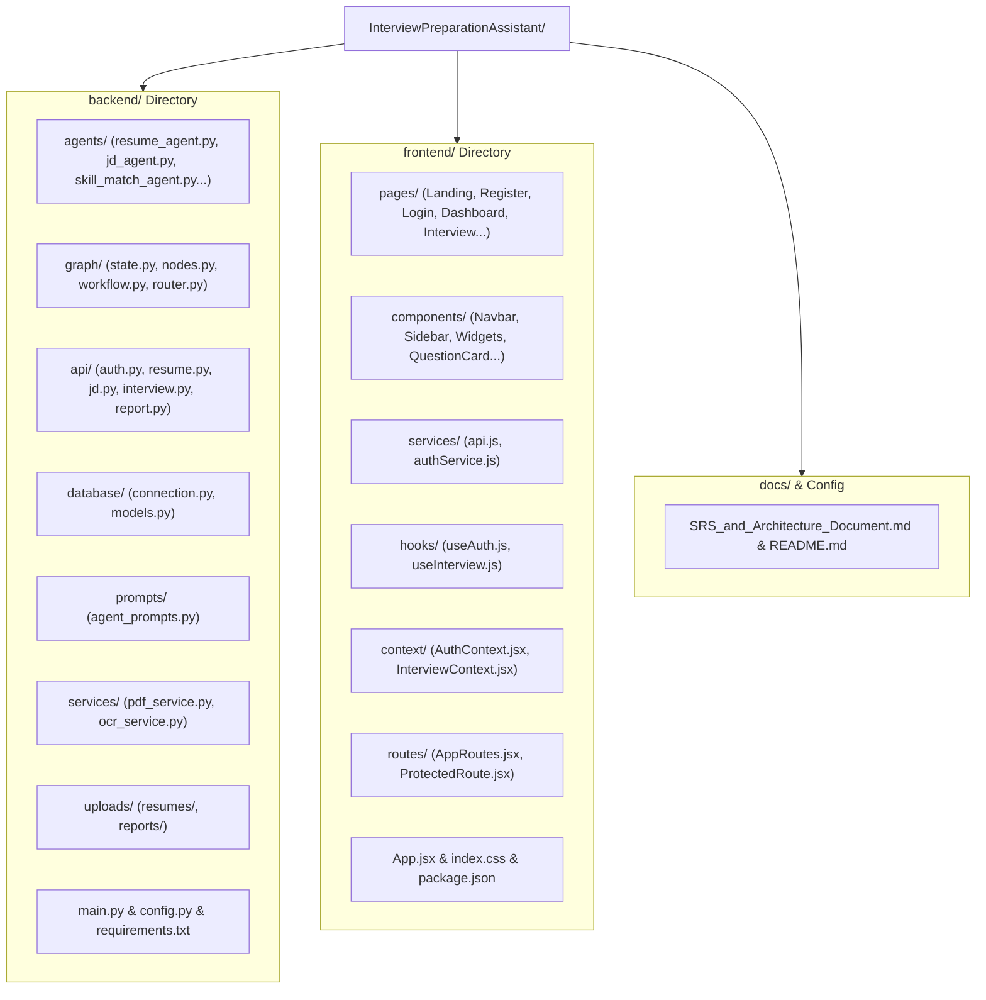

---

# Chapter 10 – Project Directory & Codebase Structure

```
InterviewPreparationAssistant/
│
├── backend/
│   ├── agents/
│   │   ├── __init__.py
│   │   ├── resume_agent.py          # Agent 1: Resume parsing & ATS calculation
│   │   ├── jd_agent.py              # Agent 2: JD requirement extraction
│   │   ├── skill_match_agent.py     # Agent 3: Skill gap & match % computation
│   │   ├── question_agent.py        # Agent 4: Technical & scenario question gen
│   │   ├── coding_agent.py          # Agent 5: DSA, SQL & code problem synthesis
│   │   ├── hr_agent.py              # Agent 6: Behavioral STAR question generator
│   │   ├── feedback_agent.py        # Agent 7: Multi-metric answer evaluator
│   │   └── report_agent.py          # Agent 8: Analytics & PDF report generator
│   │
│   ├── graph/
│   │   ├── __init__.py
│   │   ├── state.py                 # LangGraph TypedDict state schema
│   │   ├── nodes.py                 # Agent node wrappers
│   │   ├── workflow.py              # Graph compilation & execution graph
│   │   └── router.py                # Conditional routing logic functions
│   │
│   ├── api/
│   │   ├── __init__.py
│   │   ├── auth.py                  # Register, Login, Logout endpoints
│   │   ├── resume.py                # Upload & fetch parsed resume endpoints
│   │   ├── jd.py                    # Upload & fetch job description endpoints
│   │   ├── interview.py             # Start session, submit answer endpoints
│   │   └── report.py                # Fetch feedback & PDF download endpoints
│   │
│   ├── database/
│   │   ├── __init__.py
│   │   ├── connection.py            # MySQL SQLAlchemy engine & session maker
│   │   └── models.py                # Declarative ORM models (Users, Resumes, etc.)
│   │
│   ├── prompts/
│   │   └── agent_prompts.py         # System prompt templates for 8 agents
│   │
│   ├── services/
│   │   ├── pdf_service.py           # ReportLab PDF report generation
│   │   └── ocr_service.py           # PyPDF2 & text extraction engine
│   │
│   ├── uploads/
│   │   ├── resumes/                 # Uploaded candidate PDF/DOCX resumes
│   │   └── reports/                 # Generated session PDF reports
│   │
│   ├── tests/
│   │   ├── test_agents.py           # Agent unit tests
│   │   └── test_api.py              # FastAPI endpoint integration tests
│   │
│   ├── config.py                    # Environment variables (Groq Key, DB URI, JWT Secret)
│   ├── requirements.txt             # Python dependencies
│   └── main.py                      # FastAPI application entry point
│
├── frontend/
│   ├── src/
│   │   ├── assets/                  # Icons, images, logos
│   │   ├── components/              # Shared UI components (Navbar, Sidebar, Cards)
│   │   ├── context/                 # React Context (AuthContext, InterviewContext)
│   │   ├── hooks/                   # Custom hooks (useAuth, useInterview)
│   │   ├── layouts/                 # Page layout wrappers (DashboardLayout)
│   │   ├── pages/                   # 12 Page components (Dashboard, Interview...)
│   │   ├── routes/                  # Protected & public routing definitions
│   │   ├── services/                # Axios API services
│   │   ├── App.jsx                  # Main application component
│   │   └── index.css                # Tailwind CSS imports & custom styles
│   │
│   ├── package.json                 # Frontend dependencies
│   └── tailwind.config.js           # Tailwind CSS configuration
│
├── docs/
│   └── SRS_and_Architecture_Document.md
│
└── README.md                        # Master repository README
```

---

# Chapter 11 – Development Roadmap & Future Enhancements

## 11.1 Recommended Development Phases

```
Phase 1: Foundation & Authentication (Week 1-2)
  ├── MySQL schema setup & SQLAlchemy ORM creation
  ├── FastAPI JWT authentication endpoints (/register, /login)
  └── React authentication pages & AuthContext integration

Phase 2: Resume & Job Description Processing (Week 3)
  ├── Resume parsing service (PyPDF2 + OCR fallback)
  ├── Agent 1 (Resume Analyzer) & Agent 2 (JD Analyzer) implementation
  └── Resume & JD upload UI components

Phase 3: ATS Engine & Skill Matcher (Week 4)
  ├── Agent 3 (Skill Match Agent) implementation
  ├── Matching score & gap calculation logic
  └── Dashboard widget integration (ATS Score, Skill Match %)

Phase 4: Multi-Agent Interview Engine (Week 5-6)
  ├── Agent 4 (Question Generator), Agent 5 (Coding), Agent 6 (HR)
  ├── LangGraph workflow compilation (`graph/workflow.py`)
  └── Interactive mock interview UI runner component

Phase 5: Evaluation & Report Generator (Week 7)
  ├── Agent 7 (Feedback Agent) multi-metric evaluation
  ├── Agent 8 (Report Generator) & ReportLab PDF engine
  └── Feedback modal & PDF download implementation

Phase 6: Dashboard Analytics & Production Deployment (Week 8)
  ├── Chart.js integration for candidate radar charts
  ├── Admin dashboard & prompt management view
  └── Docker containerization, Vercel frontend & Render backend deployment
```

## 11.2 Future System Enhancements
1. **Voice-Based Mock Interviews**: Speech-to-text (Whisper API) and text-to-speech for real-time conversational audio interviews.
2. **Webcam Video & Emotion Analysis**: Computer vision analysis measuring candidate eye contact, posture, and facial confidence signals.
3. **Company-Specific Interview Packs**: Custom interview tracks pre-tuned for Google, Microsoft, Amazon, TCS, Infosys, and Meta interview patterns.
4. **Real-Time Collaborative Mentorship**: Live multi-user websocket rooms for human mentor co-interviewing.
5. **Integrated Online Code Compiler**: Sandbox code execution engine (Docker containerized) supporting Python, JS, C++, Java test runner execution.
6. **AI Personalized Learning Roadmaps**: Dynamic integration with online learning platforms (Coursera, Udemy, YouTube) for missing skill remediation.
7. **Interview Analytics & Skill Trends**: Long-term longitudinal progress tracking across multiple mock sessions over time.
8. **Multi-Language Support**: Support for interviewing in Spanish, French, German, Hindi, and Mandarin.
9. **Automated Reminders & Scheduling**: Calendar sync (Google Calendar / Outlook) with automated preparation reminders.
10. **LinkedIn & Job Portal Integration**: Auto-importing job descriptions directly via job URL or LinkedIn job ID.

---
*End of Software Requirements Specification & Architecture Document.*
